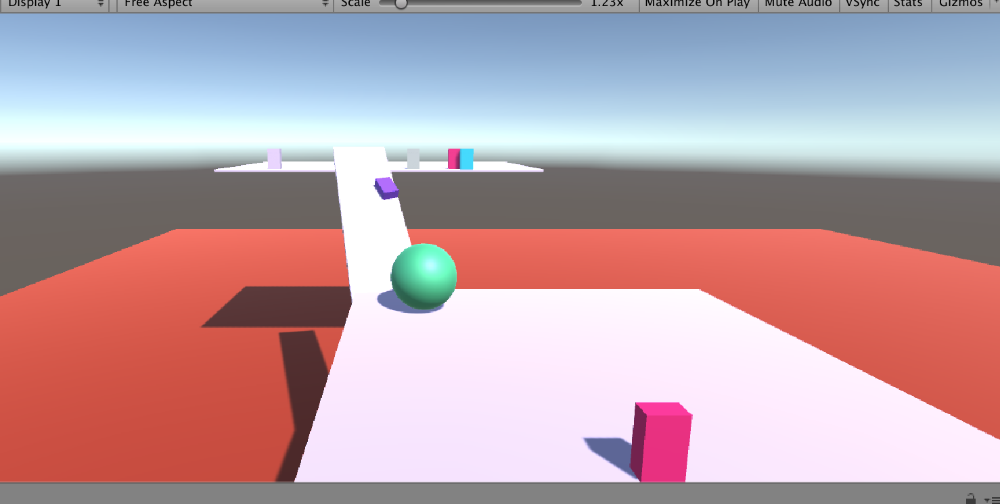

### Bailey Burke

### Hack-A-Thing-1

### CS98 Winter 2020

## What I did

I've always been interested in how one creates and codes a game. I used Unity to build a 3D game in which a player uses keyboard keys to maneuver a ball around platforms & up ramps. The player must get the ball up to the highest platform level. I had to layout the graphics/background in Unity, and then code how the ball would interact with objects, as well as how it would move, with C# scripting in Visual Studio. 

## What I learned

Essentially every platform I used for this project was new to me, and I ended up loving Unity. I had a lot of fun playing around with it, although it is definitely a complex platform with a lot of moving parts to it. In addition, I had never coded in C# before, which was the language used to write the scripts, but it was similar enough to C, which I have used for previous classes. But there were some small syntax differences which added to the learning curve. I also had never implemented a script that was connected to a specific object before, and it was interesting learning how to mesh graphics and design with code. I really enjoyed adding more obstacles to make it harder for the ball to traverse upwards. It was very satisfying once the scripts worked and there was a game that could be played. My scripting code is under Assets\ Scripts. 

## What didn't work

I was able to get the basics for the game that I wanted to make. It took a very long time trying to download Unity Hub & Unity, and figuring out which packages were needed etc,. I also spent a long time trying to get everything on the same plane and just getting the graphics lined up perfectly. I tried for a while getting the ball to defy gravity and instead of falling off of the edge would travel under the platform it was previously on (and having the camera follow it), but after many attempts I couldn't quite get it. 

## Tutorials

- https://docs.unity3d.com/Manual/GettingStartedInstallingHub.html

- https://www.youtube.com/watch?v=fstXpwkXiJw

- https://www.youtube.com/watch?v=pCBqgREiSUE

- https://www.youtube.com/watch?v=clOu4zQS8TA

## Pics

